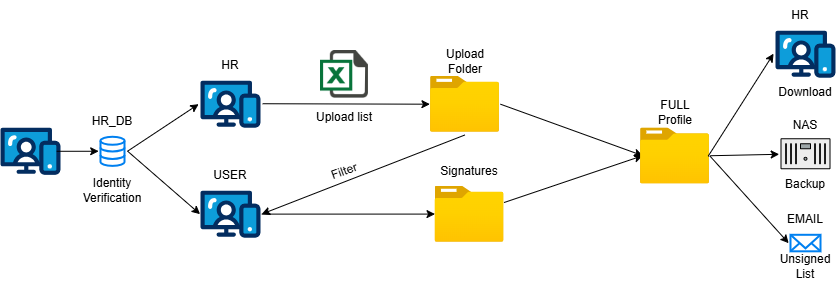

# HR-SIGNOFF-SYSTEM



# 1. 🛠 Installinon

- **Version:**
    
    **VM**:ubuntu-24.04.2-live-server-amd64
    
    **Python**: 3.12.3
    
    **PIP**:24.0 
    
    - **Python Package**:
        
        ```python
        bcrypt==4.3.0
        blinker==1.9.0
        cffi==1.17.1
        click==8.2.1
        cryptography==45.0.3
        dotenv==0.9.9
        et_xmlfile==2.0.0
        Flask==3.1.1
        itsdangerous==2.2.0
        Jinja2==3.1.6
        MarkupSafe==3.0.2
        numpy==2.2.6
        openpyxl==3.1.5
        pandas==2.2.3
        paramiko==3.5.1
        pillow==11.2.1
        pycparser==2.22
        PyNaCl==1.5.0
        pyodbc==5.2.0
        python-dateutil==2.9.0.post0
        python-dotenv==1.1.0
        pytz==2025.2
        six==1.17.0
        tzdata==2025.2
        Werkzeug==3.1.3
        
        ```
        

## Project:

```bash
git clone https://github.com/Victor-GuanChenHou/hr.git
```

## **Creat .env File**

```bash
sudo nano .env
```

```bash
HRDB_host=''
HRDB_password=''
HRDB_uid=''
HRDB_name=''
SEC_KEY=''

HRFTP_host=''
HRFTP_port=''
HRFTP_uid=''
HRFTP_password=''

MAIL=""
MAIL_PW=""
```

## Creat Service

```bash
sudo nano /etc/systemd/system/hr.service
```

```bash
[Unit]
Description=HR
After=network.target

[Service]
User=
Group=
WorkingDirectory=
Environment=
ExecStart=

Restart=always

[Install]
WantedBy=multi-user.target
```

## **Schedule**

```bash
crontab -e
```

```bash
#BACKUP
0 23 * * * cd ~/hr && ~/hr/venv/bin/python backup.py >> ~/hr/app.log 2>&1 
#EMAIL
0 8 7 * * cd ~/hr && ~/hr/venv/bin/python mailserver.py >> ~/hr/app.log 2>&1 
```

# 2.📁 Project Directory Structure Description

| **File/Folder** | Description |
| --- | --- |
| app.py | Main application entry point (Flask main program) |
| sub.py | Connect HR_DB  |
| backup.py | Backup Settlement data (SFTP to NAS) |
| mailserver.py | Email Unsigned list |
| templates/home.html | Home page |
| templates/admin.html | Manager user page(HR、IT) |
| templates/index.html | General user page |
| templates/login.html | Login page |
| temp/ | Download data temps |
| uploads/ | Uploard data temp |
| static/img/ | WEB Used img |
| static/signatures/ | General user sign picture |
| logs/ | Login log |
| history/ | Settlement data |

# 3. 🧩 **Function description**

### 1.Login:

- Account:Employee Number(A Capital)
- Password:Last nine digits of ID card


### 2.Home Page


### 3.U**ser Signature Page**


### 4.Admin Page


### 5.Others

- Download data
    
    
    
- MAIL
    
    
    

- Backup
    
    
    
- Login log
    
    
    

# 4.📥 Download Link

## Ubuntu:[https://ir.releases.ubuntu.com/24.04/](https://ir.releases.ubuntu.com/24.04/)

# 5. ✏️ Change Log

✅ Version 1.0.0 – 2025/06/03